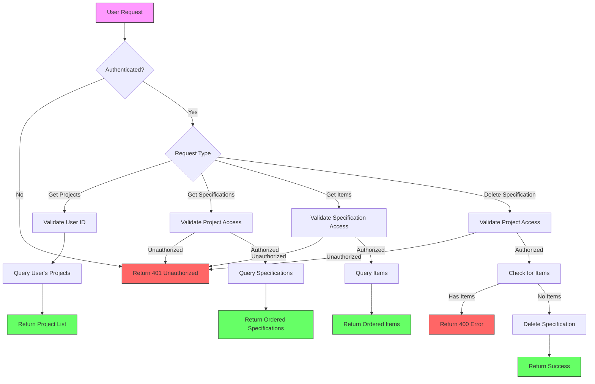
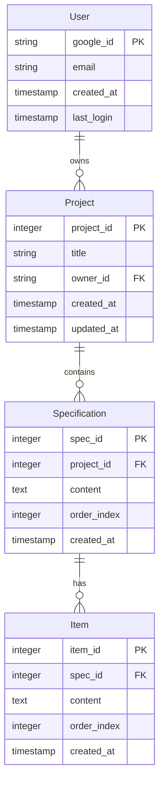
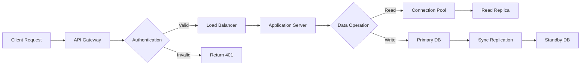

# Product Requirements Document (PRD)

# 1. INTRODUCTION

## 1.1 Purpose
This Software Requirements Specification (SRS) document provides a comprehensive description of the REST API backend system for managing specifications and projects. It is intended for software developers, system architects, and project stakeholders involved in the implementation and maintenance of the system.

## 1.2 Scope
The system will provide a backend service that enables users to manage hierarchical specifications within projects. The core functionalities include:

- User authentication and authorization using Google Cloud User Store
- Project management with user-specific ownership
- Hierarchical specification management with two levels
- RESTful API endpoints for CRUD operations

The system will be built using:
- Python with Flask framework
- PostgreSQL database
- Google Cloud User Store for authentication
- RESTful API architecture

Key features within scope:
- User authentication and session management
- Project creation and management
- Specification creation, retrieval, and deletion
- Second-level item management within specifications
- Access control based on project ownership

Out of scope:
- Frontend implementation
- Third-party integrations beyond Google Cloud User Store
- Real-time collaboration features
- Version control of specifications

# 2. PRODUCT DESCRIPTION

## 2.1 Product Perspective
The REST API backend system operates as a standalone service that interfaces with Google Cloud User Store for authentication and PostgreSQL for data persistence. It serves as the core backend infrastructure for managing specifications and projects, designed to be consumed by various frontend applications or services through its RESTful endpoints.

## 2.2 Product Functions
- User Authentication
  - Google Cloud User Store integration for secure login/logout
  - Session management and token validation
  
- Project Management
  - Creation and retrieval of user-owned projects
  - Project title and metadata management
  - Access control enforcement based on ownership

- Specification Management
  - Creation, retrieval, and deletion of specifications
  - Hierarchical organization with two-level structure
  - Ordered storage of specifications within projects
  - Unique identification system for specifications and items

- Second-level Item Management
  - Support for up to 10 bullet items per specification
  - Ordered storage and retrieval of items
  - Unique identification within parent specifications

## 2.3 User Characteristics
Primary users of the API system include:
- Software Developers: Technical users who will integrate and interact with the API endpoints
- System Administrators: IT professionals managing the backend infrastructure
- Project Owners: End users who will interact through a frontend application, requiring basic understanding of project and specification management

## 2.4 Constraints
- Technical Constraints
  - Must use Python with Flask framework
  - PostgreSQL as the only supported database
  - Google Cloud User Store as the authentication provider
  - RESTful architecture compliance requirements
  
- Business Constraints
  - Single user ownership model for projects
  - Maximum of 10 bullet items per specification
  - Specifications can only belong to one project
  - No direct specification updates (delete and recreate instead)

## 2.5 Assumptions and Dependencies
- Assumptions
  - Users have valid Google accounts for authentication
  - Stable network connectivity for API operations
  - PostgreSQL database is properly configured and accessible
  - Adequate storage capacity for specification and project data

- Dependencies
  - Google Cloud User Store availability and API stability
  - PostgreSQL database service availability
  - Python and Flask framework compatibility
  - Required Python packages and dependencies availability

# 3. PROCESS FLOWCHART



# 4. FUNCTIONAL REQUIREMENTS

## 4.1 User Authentication and Session Management

### ID: F-001
### Description
Manage user authentication through Google Cloud User Store and maintain user sessions.
### Priority
High
### Requirements

| ID | Requirement | Acceptance Criteria |
|---|---|---|
| F-001-1 | User login via Google Cloud User Store | - Successful authentication with Google credentials<br>- Return valid session token<br>- Store user information in database |
| F-001-2 | User logout functionality | - Invalidate session token<br>- Clear user session data |
| F-001-3 | Session validation | - Validate token on each protected request<br>- Return 401 for invalid sessions |

## 4.2 Project Management

### ID: F-002
### Description
Enable users to create and manage their projects.
### Priority
High
### Requirements

| ID | Requirement | Acceptance Criteria |
|---|---|---|
| F-002-1 | Create new project | - Store project with title and owner ID<br>- Generate unique project ID<br>- Return project details |
| F-002-2 | Retrieve user's projects | - Return ordered list of projects<br>- Include project title and ID<br>- Filter by owner ID |
| F-002-3 | Project access control | - Verify user ownership<br>- Return 403 for unauthorized access |

## 4.3 Specification Management

### ID: F-003
### Description
Handle creation and management of specifications within projects.
### Priority
High
### Requirements

| ID | Requirement | Acceptance Criteria |
|---|---|---|
| F-003-1 | Create specification | - Generate unique specification ID<br>- Store text content<br>- Associate with project |
| F-003-2 | List specifications | - Return ordered specifications<br>- Include IDs and content<br>- Filter by project ID |
| F-003-3 | Delete specification | - Verify no existing items<br>- Remove from database<br>- Return success status |

## 4.4 Second-level Item Management

### ID: F-004
### Description
Manage bullet items within specifications.
### Priority
Medium
### Requirements

| ID | Requirement | Acceptance Criteria |
|---|---|---|
| F-004-1 | Create bullet item | - Generate unique item ID within specification<br>- Enforce maximum 10 items<br>- Maintain item order |
| F-004-2 | List specification items | - Return ordered items<br>- Include IDs and content<br>- Filter by specification ID |
| F-004-3 | Item count validation | - Track item count per specification<br>- Prevent exceeding limit |

## 4.5 Data Validation and Error Handling

### ID: F-005
### Description
Ensure data integrity and proper error handling across all operations.
### Priority
High
### Requirements

| ID | Requirement | Acceptance Criteria |
|---|---|---|
| F-005-1 | Input validation | - Validate all request parameters<br>- Return 400 for invalid input<br>- Sanitize text content |
| F-005-2 | Error responses | - Consistent error format<br>- Appropriate HTTP status codes<br>- Clear error messages |
| F-005-3 | Database constraints | - Enforce referential integrity<br>- Handle concurrent operations<br>- Prevent orphaned records |

# 5. NON-FUNCTIONAL REQUIREMENTS

## 5.1 Performance Requirements

| Requirement | Description | Target Metric |
|------------|-------------|---------------|
| Response Time | Maximum time for API endpoint responses | < 500ms for 95% of requests |
| Database Query Performance | Maximum time for database operations | < 200ms for single record operations |
| API Throughput | Number of concurrent requests handled | Minimum 100 requests/second |
| Memory Usage | Server memory consumption | < 1GB per instance |
| Database Connections | Maximum concurrent database connections | 100 connections per instance |

## 5.2 Safety Requirements

| Requirement | Description |
|------------|-------------|
| Data Backup | Daily automated backups of PostgreSQL database |
| Failure Recovery | System must recover from crashes within 5 minutes |
| Data Consistency | Transaction rollback mechanisms for failed operations |
| Error Logging | Comprehensive error logging with stack traces |
| State Management | Maintain data integrity during concurrent operations |

## 5.3 Security Requirements

| Requirement | Description |
|------------|-------------|
| Authentication | Mandatory Google Cloud User Store authentication |
| Authorization | Role-based access control for project resources |
| Data Encryption | TLS 1.3 for data in transit |
| Database Security | Encrypted database connections and stored credentials |
| Session Management | JWT tokens with 24-hour expiration |
| Input Validation | Sanitization of all user inputs |
| API Security | Rate limiting of 1000 requests per hour per user |

## 5.4 Quality Requirements

### 5.4.1 Availability
- System uptime of 99.9% excluding planned maintenance
- Maximum planned downtime of 4 hours per month
- Automated health checks every 5 minutes

### 5.4.2 Maintainability
- Python code coverage minimum 80%
- Documentation for all API endpoints
- Automated deployment scripts
- Standardized logging format

### 5.4.3 Usability
- RESTful API compliance with OpenAPI 3.0
- Consistent error message format
- Clear API documentation with examples
- Predictable resource naming conventions

### 5.4.4 Scalability
- Horizontal scaling capability
- Database connection pooling
- Caching layer for frequently accessed data
- Stateless application design

### 5.4.5 Reliability
- Automatic failover for database
- Request retry mechanism for failed operations
- Circuit breaker pattern for external services
- Data validation at all layers

## 5.5 Compliance Requirements

| Requirement | Description |
|------------|-------------|
| Data Privacy | GDPR compliance for user data handling |
| API Standards | REST API design following RFC 7231 |
| Authentication | OAuth 2.0 compliance |
| Documentation | OpenAPI Specification compliance |
| Error Handling | RFC 7807 Problem Details compliance |
| Database | SQL:2016 standard compliance |
| Character Encoding | UTF-8 encoding for all text data |

# 6. DATA REQUIREMENTS

## 6.1 Data Models



## 6.2 Data Storage

| Aspect | Requirement |
|--------|-------------|
| Database Engine | PostgreSQL 14+ with TimescaleDB extension |
| Data Retention | Active data retained indefinitely |
| Backup Schedule | Daily full backups with 30-day retention |
| Point-in-Time Recovery | 7-day rolling window |
| Replication | Synchronous replication with one standby |
| Storage Scaling | Automatic storage expansion up to 1TB |
| Connection Pooling | PgBouncer with max 100 connections |
| Vacuum Strategy | Automated vacuum when 20% of rows are dead |

## 6.3 Data Processing



### 6.3.1 Data Security Controls

| Control Type | Implementation |
|-------------|----------------|
| Data at Rest | AES-256 encryption |
| Data in Transit | TLS 1.3 encryption |
| Access Control | Row-level security in PostgreSQL |
| Audit Logging | All data modifications logged |
| Data Masking | PII data masked in logs |
| Query Security | Prepared statements only |
| Connection Security | SSL required for all connections |

### 6.3.2 Data Integrity Controls

| Control | Description |
|---------|-------------|
| Foreign Keys | Enforced at database level |
| Unique Constraints | Applied to IDs and business keys |
| Check Constraints | Item count limit per specification |
| Transactions | ACID compliance for all operations |
| Validation | Server-side input validation |
| Consistency | Strong consistency model |

## 6.4 Data Migration

| Phase | Requirements |
|-------|-------------|
| Schema Changes | Zero-downtime migrations |
| Data Import | Bulk import support up to 1GB |
| Export Format | JSON and CSV support |
| Version Control | Schema version tracking |
| Rollback | Point-in-time recovery capability |
| Validation | Automated data integrity checks |

## 6.5 Data Monitoring

| Metric | Threshold |
|--------|-----------|
| Query Performance | Alert if > 1s |
| Storage Usage | Alert at 80% capacity |
| Connection Count | Alert at 90% pool usage |
| Replication Lag | Alert if > 30s |
| Dead Tuples | Alert at 30% |
| Cache Hit Ratio | Alert if < 90% |
| Index Usage | Alert if < 95% |

# 7. EXTERNAL INTERFACES

## 7.1 Software Interfaces

| Interface | Description | Protocol/Format | Requirements |
|-----------|-------------|-----------------|--------------|
| Google Cloud User Store | Authentication service | OAuth 2.0/HTTPS | - Support OpenID Connect<br>- JWT token handling<br>- Secure credential storage |
| PostgreSQL Database | Data persistence | PostgreSQL Wire Protocol | - Connection pooling<br>- SSL/TLS encryption<br>- Version 14+ compatibility |
| Flask Framework | Web application framework | WSGI | - Python 3.8+<br>- RESTful routing<br>- Request/Response handling |
| Load Balancer | Request distribution | HTTP/HTTPS | - Health check support<br>- SSL termination<br>- Session persistence |

## 7.2 Communication Interfaces

### 7.2.1 API Communication

| Aspect | Specification |
|--------|---------------|
| Protocol | HTTPS (TLS 1.3) |
| Data Format | JSON (UTF-8 encoded) |
| API Style | REST |
| Content-Type | application/json |
| Authentication | Bearer token |
| Rate Limiting | 1000 requests/hour/user |

### 7.2.2 Database Communication

| Aspect | Specification |
|--------|---------------|
| Protocol | PostgreSQL Wire Protocol |
| Port | 5432 |
| Connection Security | SSL/TLS |
| Connection Pooling | PgBouncer |
| Max Connections | 100 per instance |
| Timeout | 30 seconds |

### 7.2.3 Error Response Format

```json
{
  "error": {
    "code": "string",
    "message": "string",
    "details": "object",
    "timestamp": "ISO8601 string"
  }
}
```

## 7.3 Network Interfaces

| Interface | Requirements |
|-----------|--------------|
| HTTP/HTTPS | - Port 80/443<br>- TLS 1.3 support<br>- HTTP/2 enabled |
| Internal Network | - Private subnet connectivity<br>- VPC peering support<br>- Network ACLs |
| Load Balancing | - Layer 7 routing<br>- WebSocket support<br>- Custom header handling |
| DNS | - Custom domain support<br>- DNSSEC enabled<br>- Health check integration |

# 8. APPENDICES

## 8.1 GLOSSARY

| Term | Definition |
|------|------------|
| Specification | A text string with a unique numeric identifier that belongs to a single project |
| Bullet Item | A second-level text entry belonging to a specification, with a locally unique ID |
| Project | A collection of specifications with a title, owned by a single user |
| Owner | The user who created and has exclusive write access to a project |
| Session Token | A JWT-based authentication token issued after successful Google login |
| Connection Pool | A cache of database connections maintained for reuse |

## 8.2 ACRONYMS

| Acronym | Definition |
|---------|------------|
| API | Application Programming Interface |
| CRUD | Create, Read, Update, Delete |
| GDPR | General Data Protection Regulation |
| HTTP | Hypertext Transfer Protocol |
| HTTPS | Hypertext Transfer Protocol Secure |
| JWT | JSON Web Token |
| REST | Representational State Transfer |
| SQL | Structured Query Language |
| SSL | Secure Sockets Layer |
| TLS | Transport Layer Security |
| URI | Uniform Resource Identifier |
| VPC | Virtual Private Cloud |
| WSGI | Web Server Gateway Interface |

## 8.3 ADDITIONAL REFERENCES

| Reference | Description | URL |
|-----------|-------------|-----|
| Flask Documentation | Official Flask framework documentation | https://flask.palletsprojects.com/ |
| PostgreSQL Documentation | Official PostgreSQL database documentation | https://www.postgresql.org/docs/ |
| Google Cloud Identity Platform | Documentation for Google Cloud User Store | https://cloud.google.com/identity-platform/docs |
| REST API Guidelines | Microsoft REST API Guidelines | https://github.com/microsoft/api-guidelines |
| OpenAPI Specification | REST API documentation standard | https://swagger.io/specification/ |
| RFC 7231 | HTTP/1.1 Semantics and Content | https://tools.ietf.org/html/rfc7231 |
| RFC 7807 | Problem Details for HTTP APIs | https://tools.ietf.org/html/rfc7807 |
| Python Style Guide | PEP 8 -- Style Guide for Python Code | https://www.python.org/dev/peps/pep-0008/ |