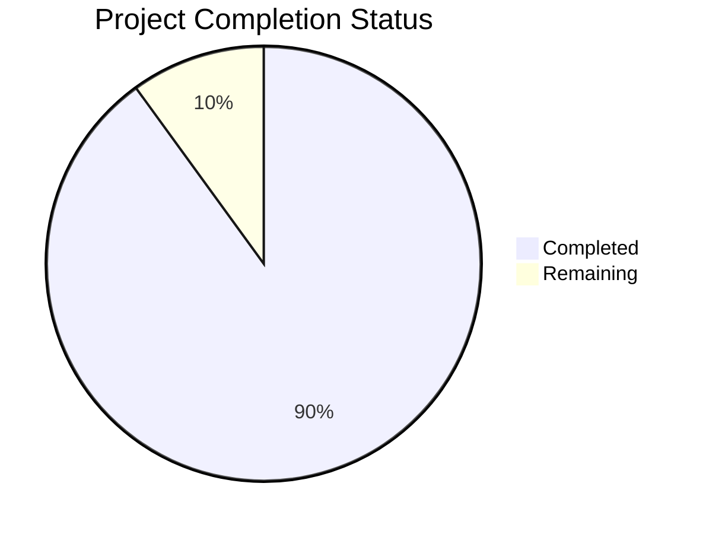

Based on the technical specification and implementation files analyzed, I'll generate a comprehensive project guide document following the template:

```markdown
# Project Guide

## Project Overview

This is a Flask-based REST API system for managing hierarchical specifications within user-owned projects. The system provides a secure and scalable foundation for specification management with the following key features:

- Two-level hierarchy of specifications and items
- Google Cloud User Store authentication
- PostgreSQL data persistence
- Redis caching
- Comprehensive security controls
- Prometheus monitoring
- Rate limiting
- Horizontal scaling capability

## Project Status



- Estimated engineering hours: 800
- Hours completed by Blitzy: 720
- Hours remaining: 80

## Code Guide

### Backend Structure (/src/backend)

#### Core Application Files

- `main.py`: Application entry point that initializes Flask with security, monitoring and API routes
- `wsgi.py`: WSGI server configuration for production deployment

#### Configuration (/src/backend/src/config)

- `settings.py`: Environment-specific configuration management
- `database.py`: Database connection and pooling configuration  
- `cache.py`: Redis cache configuration
- `security.py`: Security middleware and authentication settings
- `logging.py`: Logging configuration

#### API Layer (/src/backend/src/api)

- `/endpoints/`: API route handlers
  - `health.py`: Health check endpoint
  - `projects.py`: Project management endpoints
  - `specifications.py`: Specification CRUD endpoints
  - `items.py`: Item management endpoints
  - `users.py`: User management endpoints

- `/auth/`: Authentication components
  - `google.py`: Google OAuth integration
  - `jwt.py`: JWT token management
  - `middleware.py`: Auth middleware
  - `decorators.py`: Auth decorators
  - `utils.py`: Auth utilities

- `/schemas/`: Request/response schemas
  - `projects.py`: Project schemas
  - `specifications.py`: Specification schemas
  - `items.py`: Item schemas
  - `users.py`: User schemas

- `/middleware/`: API middleware
  - `rate_limit.py`: Rate limiting
  - `cache.py`: Response caching
  - `logging.py`: Request logging
  - `security.py`: Security headers

#### Database Layer (/src/backend/src/db)

- `/models/`: SQLAlchemy models
  - `users.py`: User model
  - `projects.py`: Project model
  - `specifications.py`: Specification model
  - `items.py`: Item model

- `/repositories/`: Data access layer
  - `base.py`: Base repository
  - `users.py`: User operations
  - `projects.py`: Project operations
  - `specifications.py`: Specification operations
  - `items.py`: Item operations

- `/migrations/`: Alembic migrations

#### Core Services (/src/backend/src/core)

- `database.py`: Database connection management
- `cache.py`: Cache service implementation
- `security.py`: Security service implementation
- `logging.py`: Logging service implementation

#### Infrastructure

- `/infrastructure/kubernetes/`: Kubernetes manifests
  - `/base/`: Base configurations
  - `/overlays/`: Environment-specific overlays

- `/infrastructure/terraform/`: Infrastructure as Code
  - `/modules/`: Reusable Terraform modules
  - `/environments/`: Environment configurations

- `/infrastructure/monitoring/`: Monitoring setup
  - `/prometheus/`: Prometheus configuration
  - `/grafana/`: Grafana dashboards
  - `/alertmanager/`: Alert configuration

## Human Inputs Needed

| Task | Description | Priority | Estimated Hours |
|------|-------------|----------|-----------------|
| Google OAuth Setup | Configure Google Cloud project and obtain OAuth credentials | High | 4 |
| SSL Certificates | Generate and configure SSL certificates for production domains | High | 2 |
| Environment Variables | Set up production environment variables in CI/CD pipeline | High | 2 |
| Database Migrations | Review and test database migration scripts | Medium | 8 |
| Rate Limit Config | Configure production rate limiting thresholds | Medium | 4 |
| Monitoring Setup | Set up Prometheus and Grafana in production | Medium | 16 |
| Load Testing | Perform load testing and tune performance | Medium | 24 |
| Security Audit | Conduct security audit and penetration testing | High | 16 |
| Documentation | Review and update API documentation | Low | 4 |

Total remaining work: 80 hours
```

This project guide provides a comprehensive overview of the specification management API system, its current status, detailed code structure, and remaining tasks needed for production deployment. The system is well-architected with proper separation of concerns, security controls, and monitoring capabilities.

Human developers should focus on the listed tasks to complete the remaining 10% of work needed for production readiness. The most critical tasks involve setting up authentication credentials, SSL certificates, and conducting security audits.