# Technical Specifications

# 1. INTRODUCTION

## 1.1 EXECUTIVE SUMMARY

This technical specification outlines a REST API backend system designed to manage hierarchical specifications within user-owned projects. The system addresses the need for structured specification management with a two-level hierarchy, robust access control, and seamless user authentication. Built on Python/Flask with PostgreSQL storage and Google Cloud User Store authentication, it provides a secure and scalable foundation for specification management applications.

The system serves technical users and project stakeholders who require organized storage and retrieval of specifications with controlled access and hierarchical organization. By implementing strict ownership controls and clear structural boundaries, it ensures data integrity while maintaining flexibility for various use cases.

## 1.2 SYSTEM OVERVIEW

### Project Context

| Aspect | Description |
|--------|-------------|
| Business Context | Enterprise specification management requiring secure, user-specific content organization |
| System Type | New implementation - REST API backend service |
| Integration Points | Google Cloud User Store for authentication, PostgreSQL for data persistence |

### High-Level Description

| Component | Implementation |
|-----------|----------------|
| Authentication | Google Cloud User Store with JWT token management |
| API Framework | Flask-based RESTful service architecture |
| Data Storage | PostgreSQL with structured schema design |
| Access Control | User-based ownership model with project-level isolation |

### Success Criteria

| Criterion | Target Metric |
|-----------|---------------|
| API Response Time | 95% of requests complete within 500ms |
| Data Consistency | 100% accuracy in specification hierarchy maintenance |
| Authentication Success | 99.9% successful authentication rate |
| System Availability | 99.9% uptime excluding planned maintenance |

## 1.3 SCOPE

### In-Scope

#### Core Features and Functionalities

| Feature Category | Included Capabilities |
|-----------------|----------------------|
| User Management | - Google authentication<br>- Session management<br>- User profile storage |
| Project Management | - Project creation<br>- Project ownership<br>- Project metadata management |
| Specification Management | - Hierarchical specification storage<br>- Ordered specification lists<br>- Specification deletion |
| Item Management | - Second-level item creation<br>- Item ordering<br>- Item count limitations |

#### Implementation Boundaries

| Boundary Type | Coverage |
|--------------|----------|
| User Groups | Authenticated Google account holders |
| Access Control | Single-owner project model |
| Data Structure | Two-level specification hierarchy |
| API Architecture | RESTful endpoints with JSON payloads |

### Out-of-Scope

- Frontend implementation and user interface
- Real-time collaboration features
- Document version control
- File attachment handling
- Third-party integrations beyond Google Cloud User Store
- Specification sharing between users
- Bulk import/export capabilities
- Advanced search functionality
- Notification system
- Audit logging
- Custom authentication providers
- Offline operation support

# 2. SYSTEM ARCHITECTURE

## 2.1 High-Level Architecture

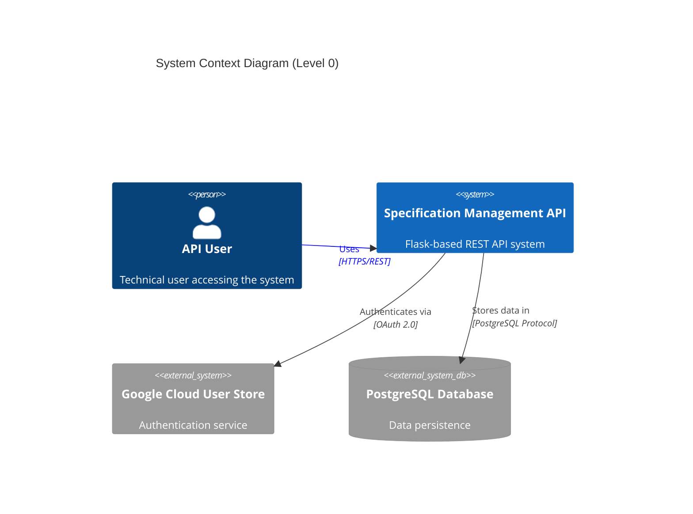

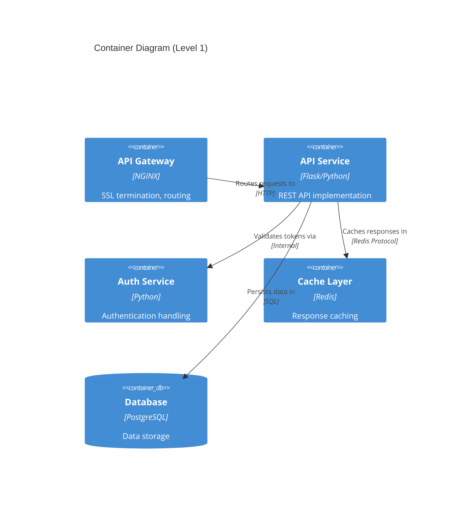

## 2.2 Component Details

| Component | Purpose | Technology | Scaling Strategy |
|-----------|---------|------------|------------------|
| API Gateway | Request routing, SSL termination | NGINX | Horizontal scaling |
| API Service | Core business logic | Flask/Python | Horizontal scaling with stateless design |
| Auth Service | Authentication management | Python/JWT | Horizontal scaling |
| Cache Layer | Response caching | Redis | Master-replica configuration |
| Database | Data persistence | PostgreSQL | Primary-replica replication |

## 2.3 Technical Decisions

### Architecture Style

| Decision | Rationale |
|----------|-----------|
| Monolithic API | - Simplified deployment<br>- Reduced operational complexity<br>- Suitable for current scale |
| REST Architecture | - Standard HTTP methods<br>- Stateless design<br>- Clear resource hierarchy |
| Layer Separation | - Clear separation of concerns<br>- Independent scaling<br>- Maintainable codebase |

### Data Management

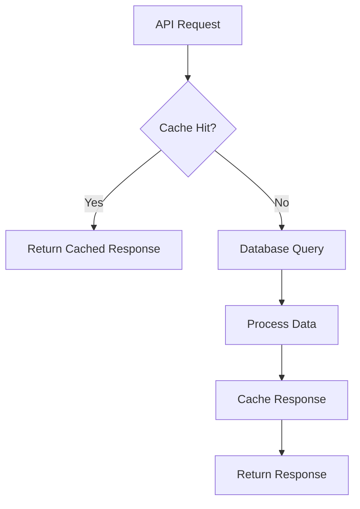

## 2.4 Cross-Cutting Concerns

### Monitoring and Security

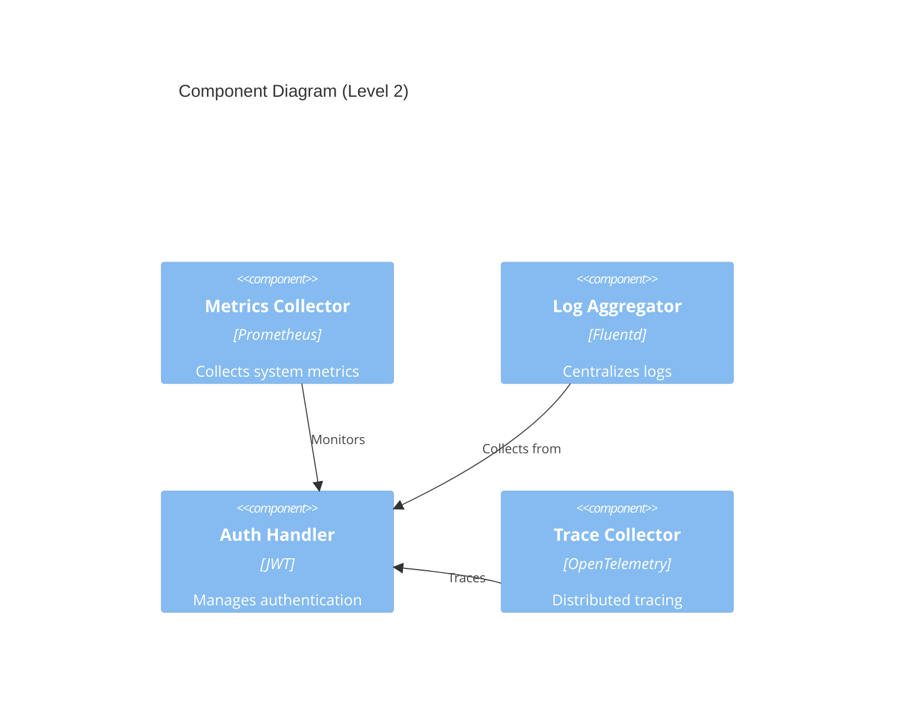

### Deployment Architecture

```mermaid
deployment
    title Deployment Diagram
    
    node "Load Balancer" {
        component NGINX
    }
    
    node "Application Servers" {
        component "Flask API" as api1
        component "Flask API" as api2
    }
    
    node "Cache Cluster" {
        component "Redis Primary" as redis1
        component "Redis Replica" as redis2
    }
    
    node "Database Cluster" {
        component "PostgreSQL Primary" as pg1
        component "PostgreSQL Replica" as pg2
    }
    
    NGINX --> api1
    NGINX --> api2
    api1 --> redis1
    api2 --> redis1
    redis1 --> redis2
    api1 --> pg1
    api2 --> pg1
    pg1 --> pg2
```

## 2.5 Data Flow Patterns

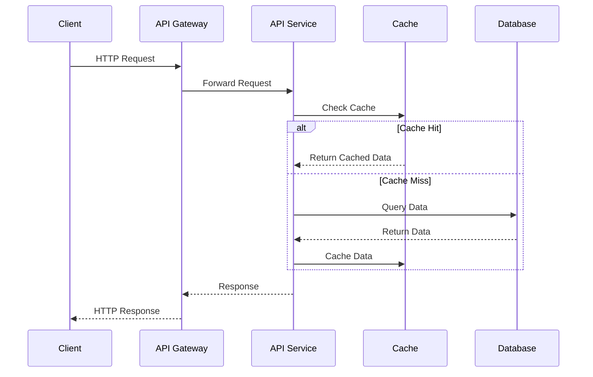

## 2.6 Performance Characteristics

| Component | Target Metric | Scaling Trigger |
|-----------|--------------|-----------------|
| API Gateway | 10,000 req/s | CPU > 70% |
| API Service | 1,000 req/s per instance | Memory > 80% |
| Cache Layer | 100,000 ops/s | Memory > 75% |
| Database | 5,000 transactions/s | CPU > 75% or Storage > 80% |

## 2.7 Disaster Recovery

| Scenario | Recovery Strategy | RTO | RPO |
|----------|------------------|-----|-----|
| Service Failure | Auto-scaling replacement | 5 min | 0 min |
| Cache Failure | Replica promotion | 1 min | 0 min |
| Database Failure | Failover to replica | 3 min | 30 sec |
| Region Failure | Cross-region recovery | 30 min | 5 min |

# 3. SYSTEM COMPONENTS ARCHITECTURE

## 3.1 DATABASE DESIGN

### 3.1.1 Schema Design

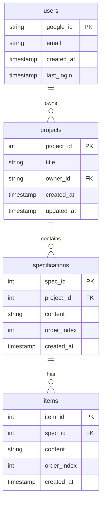

### 3.1.2 Table Structures and Constraints

| Table | Primary Key | Foreign Keys | Indexes | Constraints |
|-------|-------------|--------------|---------|-------------|
| users | google_id | - | email_idx | email NOT NULL, UNIQUE |
| projects | project_id | owner_id → users.google_id | owner_id_idx | title NOT NULL |
| specifications | spec_id | project_id → projects.project_id | project_id_idx, order_idx | content NOT NULL |
| items | item_id | spec_id → specifications.spec_id | spec_id_idx, order_idx | content NOT NULL, items_per_spec_check |

### 3.1.3 Data Management Strategy

| Aspect | Implementation |
|--------|----------------|
| Partitioning | None required for initial scale |
| Backup Schedule | Daily full backups with 7-day retention |
| Data Retention | Indefinite for active records |
| Archival Policy | None required initially |
| Audit Logging | Changes tracked in created_at/updated_at |

## 3.2 API DESIGN

### 3.2.1 Authentication Flow

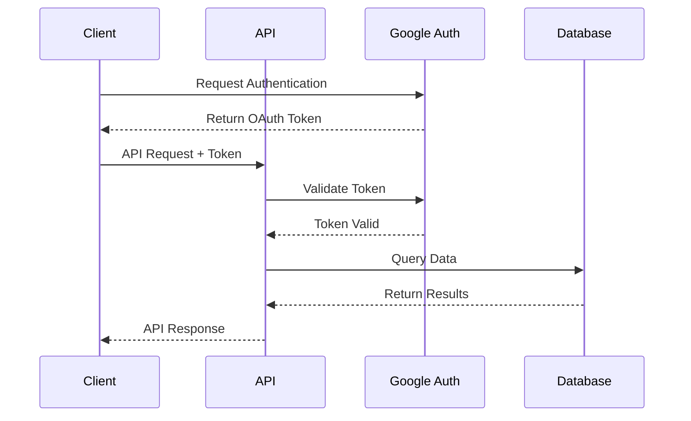

### 3.2.2 API Endpoints

| Endpoint | Method | Purpose | Authentication |
|----------|--------|---------|----------------|
| /api/v1/specifications | GET | List specifications | Required |
| /api/v1/specifications/{id} | DELETE | Delete specification | Required |
| /api/v1/specifications/{id}/items | GET | List items | Required |
| /api/v1/projects | GET | List user projects | Required |

### 3.2.3 Response Formats

```json
{
    "data": {
        "items": [],
        "metadata": {
            "total": 0,
            "page": 1
        }
    },
    "status": "success",
    "timestamp": "ISO-8601"
}
```

## 3.3 SECURITY ARCHITECTURE

### 3.3.1 Authentication Flow

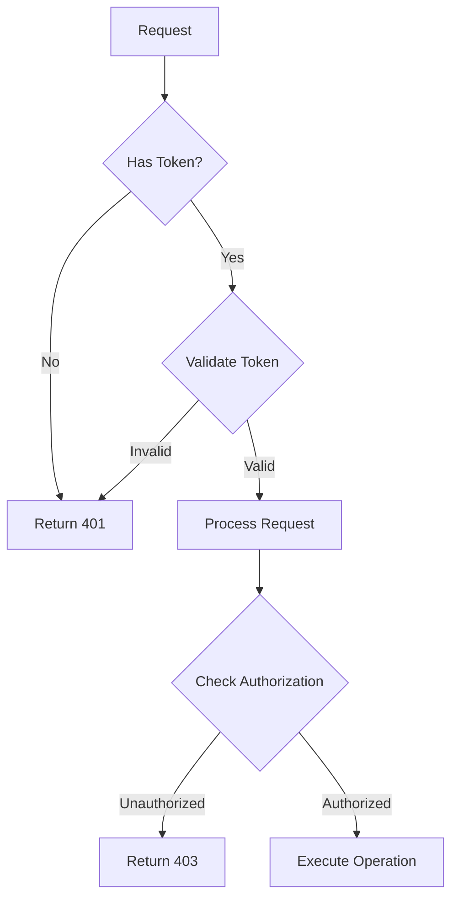

### 3.3.2 Security Controls

| Layer | Control | Implementation |
|-------|---------|----------------|
| Transport | TLS | TLS 1.3 required |
| Authentication | OAuth 2.0 | Google Cloud User Store |
| Authorization | RBAC | Project ownership based |
| Data | Encryption | AES-256 at rest |
| API | Rate Limiting | 1000 req/hour/user |

## 3.4 CACHING STRATEGY

### 3.4.1 Cache Hierarchy

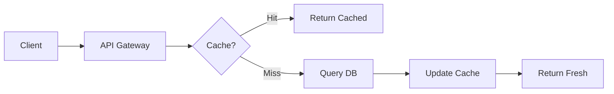

### 3.4.2 Cache Configuration

| Cache Type | TTL | Invalidation Strategy |
|------------|-----|----------------------|
| Project List | 5 min | On project update |
| Specifications | 2 min | On specification change |
| Items | 2 min | On item modification |
| User Data | 15 min | On profile update |

## 3.5 ERROR HANDLING

### 3.5.1 Error Response Format

```json
{
    "error": {
        "code": "ERROR_CODE",
        "message": "Human readable message",
        "details": {},
        "timestamp": "ISO-8601"
    }
}
```

### 3.5.2 Error Codes

| HTTP Status | Error Code | Description |
|-------------|------------|-------------|
| 400 | INVALID_INPUT | Request validation failed |
| 401 | UNAUTHORIZED | Missing/invalid token |
| 403 | FORBIDDEN | Insufficient permissions |
| 404 | NOT_FOUND | Resource not found |
| 429 | RATE_LIMITED | Too many requests |

# 4. TECHNOLOGY STACK

## 4.1 PROGRAMMING LANGUAGES

| Language | Version | Component | Justification |
|----------|---------|-----------|---------------|
| Python | 3.8+ | Backend Services | - Strong ecosystem for web services<br>- Extensive library support<br>- Excellent PostgreSQL integration<br>- Clear syntax for maintainability |
| SQL | PostgreSQL 14+ | Database Queries | - Native PostgreSQL support<br>- Complex query capabilities<br>- ACID compliance requirements |
| Shell Script | Bash 5+ | Deployment Scripts | - System automation<br>- Environment setup<br>- Maintenance tasks |

## 4.2 FRAMEWORKS & LIBRARIES

### Core Frameworks

| Framework | Version | Purpose | Justification |
|-----------|---------|---------|---------------|
| Flask | 2.0+ | Web Framework | - Lightweight and flexible<br>- RESTful routing support<br>- Extensive middleware ecosystem<br>- Simple integration with Google Auth |
| SQLAlchemy | 1.4+ | ORM | - Robust PostgreSQL support<br>- Migration management<br>- Connection pooling<br>- Query optimization |
| Flask-RESTful | 0.3+ | REST API | - Standardized REST implementation<br>- Request parsing<br>- Resource routing |

### Supporting Libraries

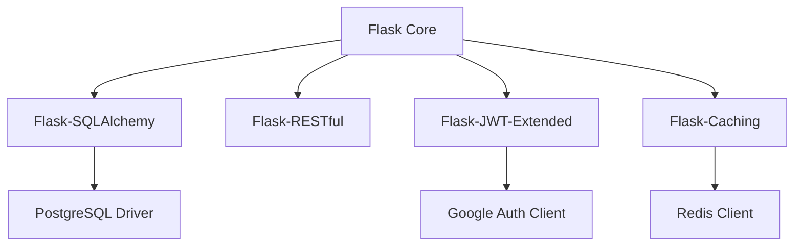

| Library | Version | Purpose |
|---------|---------|---------|
| psycopg2-binary | 2.9+ | PostgreSQL adapter |
| flask-jwt-extended | 4.0+ | JWT token handling |
| google-auth | 2.0+ | Google authentication |
| flask-caching | 1.10+ | Response caching |
| marshmallow | 3.0+ | Data serialization |

## 4.3 DATABASES & STORAGE

### Primary Database

| Component | Technology | Configuration |
|-----------|------------|---------------|
| RDBMS | PostgreSQL 14+ | - Primary-replica setup<br>- Synchronous replication<br>- Connection pooling via PgBouncer |
| Caching | Redis 6+ | - Master-replica configuration<br>- Persistence enabled<br>- SSL/TLS encryption |

### Storage Architecture

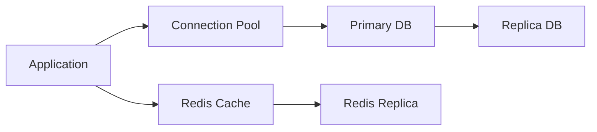

## 4.4 THIRD-PARTY SERVICES

| Service | Purpose | Integration Method |
|---------|---------|-------------------|
| Google Cloud User Store | Authentication | OAuth 2.0/OpenID Connect |
| Google Cloud Storage | Backup Storage | Cloud Storage API |
| Prometheus | Metrics Collection | Metrics endpoint |
| Grafana | Monitoring Dashboard | Prometheus data source |

### Service Dependencies

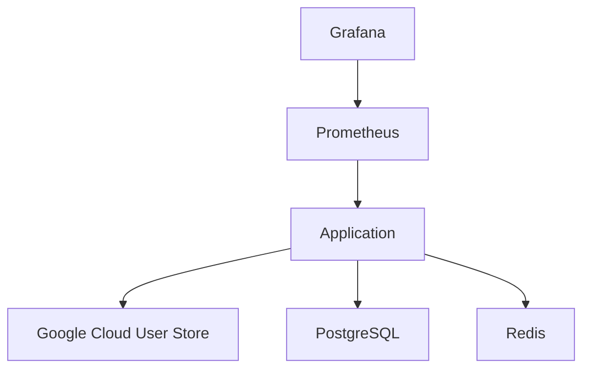

## 4.5 DEVELOPMENT & DEPLOYMENT

### Development Tools

| Tool | Version | Purpose |
|------|---------|---------|
| Poetry | 1.0+ | Dependency management |
| Black | 22.0+ | Code formatting |
| Pylint | 2.0+ | Code linting |
| pytest | 6.0+ | Unit testing |

### Deployment Pipeline

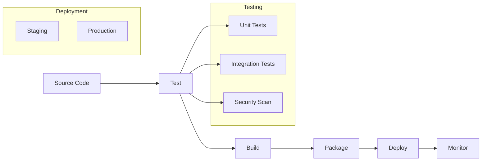

### Container Configuration

| Component | Base Image | Exposed Ports |
|-----------|------------|---------------|
| API Service | python:3.8-slim | 8000 |
| PostgreSQL | postgres:14-alpine | 5432 |
| Redis | redis:6-alpine | 6379 |
| Nginx | nginx:1.21-alpine | 80, 443 |

# 5. SYSTEM DESIGN

## 5.1 DATABASE DESIGN

### 5.1.1 Schema Overview


### 5.1.2 Table Relationships

| Relationship | Type | Constraints | Notes |
|--------------|------|-------------|-------|
| users → projects | One-to-Many | ON DELETE CASCADE | User owns multiple projects |
| projects → specifications | One-to-Many | ON DELETE CASCADE | Project contains ordered specifications |
| specifications → items | One-to-Many | ON DELETE CASCADE | Specification has max 10 items |

### 5.1.3 Indexes and Performance

| Table | Index | Type | Purpose |
|-------|-------|------|---------|
| users | google_id_idx | PRIMARY | Primary lookup |
| users | email_idx | UNIQUE | Email uniqueness |
| projects | owner_id_idx | BTREE | Owner filtering |
| specifications | project_order_idx | BTREE | Ordered retrieval |
| items | spec_order_idx | BTREE | Ordered retrieval |

## 5.2 API DESIGN

### 5.2.1 Authentication Flow

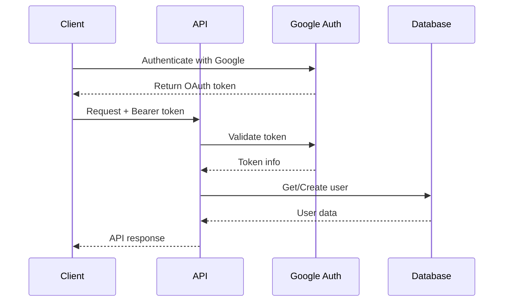

### 5.2.2 Core Endpoints

| Endpoint | Method | Description | Request | Response |
|----------|--------|-------------|---------|-----------|
| /api/v1/projects | GET | List user projects | - | Project[] |
| /api/v1/projects/{id}/specifications | GET | List specifications | - | Specification[] |
| /api/v1/specifications/{id} | DELETE | Delete specification | - | 204 No Content |
| /api/v1/specifications/{id}/items | GET | List items | - | Item[] |

### 5.2.3 Response Formats

```json
{
    "data": {
        "items": [],
        "metadata": {
            "total": 0,
            "page": 1
        }
    },
    "status": "success",
    "timestamp": "2024-01-20T12:00:00Z"
}
```

## 5.3 DATA FLOW

### 5.3.1 Request Processing Flow

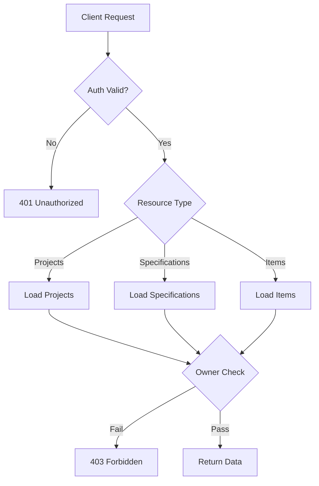

### 5.3.2 Data Access Patterns

| Operation | Access Pattern | Caching Strategy |
|-----------|---------------|------------------|
| List Projects | Index Scan on owner_id | 5 min TTL |
| List Specifications | Index Scan on project_id + order | 2 min TTL |
| Get Items | Index Scan on spec_id + order | 2 min TTL |
| Delete Specification | Primary Key + Foreign Key Check | Cache invalidation |

## 5.4 SECURITY DESIGN

### 5.4.1 Authentication Layer

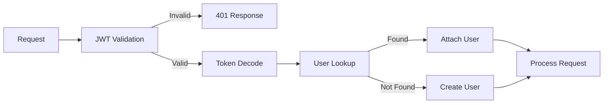

### 5.4.2 Authorization Controls

| Resource | Access Control | Validation |
|----------|---------------|------------|
| Projects | Owner only | google_id match |
| Specifications | Project owner | project ownership |
| Items | Specification owner | parent ownership |

## 5.5 SCALABILITY DESIGN

### 5.5.1 Component Scaling

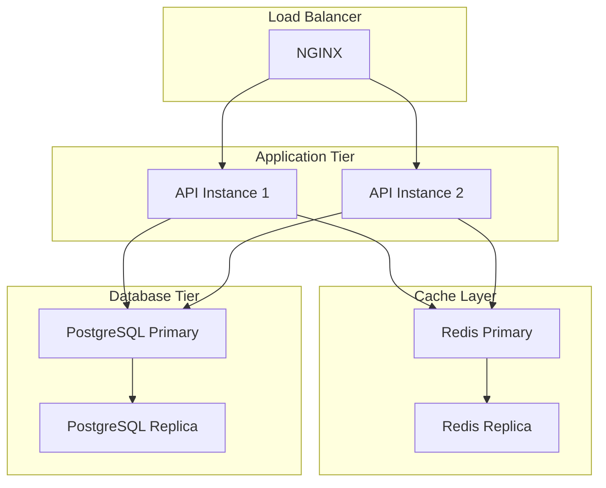

### 5.5.2 Performance Optimizations

| Component | Optimization | Impact |
|-----------|-------------|---------|
| Database | Connection pooling | Reduced connection overhead |
| API | Response caching | Lower latency |
| Authentication | Token caching | Reduced auth overhead |
| Queries | Optimized indexes | Faster data retrieval |

# 6. USER INTERFACE DESIGN

No user interface required. This is a backend REST API system designed to be consumed by frontend applications or services through HTTP requests. The system provides data and functionality through documented API endpoints rather than direct user interfaces.

All user interactions should be implemented by consuming applications using the provided REST APIs for:
- User authentication 
- Project management
- Specification management
- Item management

Frontend implementations can reference the API documentation for proper integration patterns and data formats.

# 7. SECURITY CONSIDERATIONS

## 7.1 AUTHENTICATION AND AUTHORIZATION

### 7.1.1 Authentication Flow

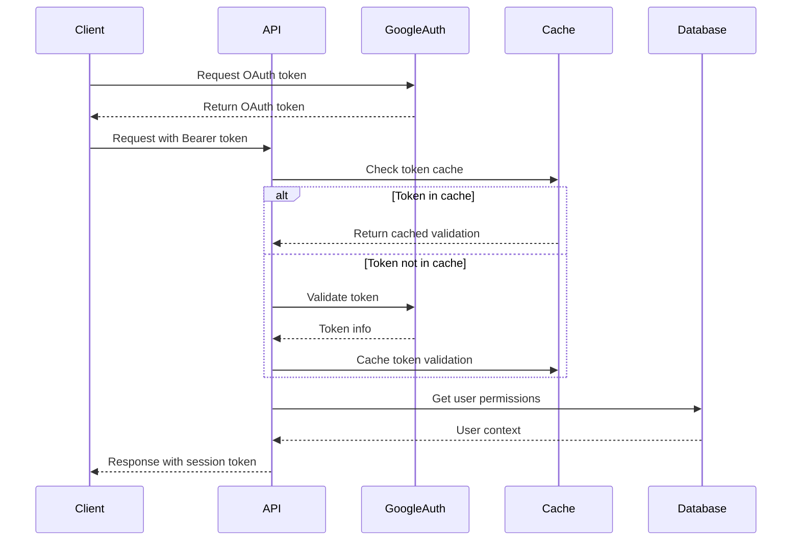

### 7.1.2 Authorization Matrix

| Resource | Action | Owner | Unauthenticated | Notes |
|----------|--------|-------|-----------------|-------|
| Project | Create | ✓ | ✗ | Requires valid session |
| Project | Read | ✓ | ✗ | Owner only access |
| Project | Delete | ✓ | ✗ | Owner only access |
| Specification | Create | ✓ | ✗ | Within owned project |
| Specification | Read | ✓ | ✗ | Within owned project |
| Specification | Delete | ✓ | ✗ | Within owned project |
| Items | Manage | ✓ | ✗ | Within owned specification |

## 7.2 DATA SECURITY

### 7.2.1 Data Protection Measures

| Layer | Protection Mechanism | Implementation |
|-------|---------------------|----------------|
| Transport | TLS 1.3 | NGINX SSL termination |
| Application | Input sanitization | Flask request validation |
| Session | JWT encryption | HS256 algorithm |
| Database | Column encryption | AES-256-GCM |
| Backup | Encrypted storage | Google Cloud KMS |

### 7.2.2 Data Classification

| Data Type | Classification | Protection Level | Example |
|-----------|---------------|------------------|---------|
| User Credentials | High | Encrypted at rest and in transit | Google OAuth tokens |
| Project Content | Medium | Encrypted in transit | Specification text |
| System Metadata | Low | Standard protection | Timestamps |

## 7.3 SECURITY PROTOCOLS

### 7.3.1 Request Security Flow

```mermaid
flowchart TD
    A[Request] --> B{SSL/TLS}
    B -->|Invalid| C[Reject]
    B -->|Valid| D{Rate Limit}
    D -->|Exceeded| E[429 Too Many]
    D -->|Passed| F{Auth Token}
    F -->|Invalid| G[401 Unauthorized]
    F -->|Valid| H{Authorization}
    H -->|Denied| I[403 Forbidden]
    H -->|Granted| J[Process Request]
```

### 7.3.2 Security Controls

| Control Type | Implementation | Monitoring |
|-------------|----------------|------------|
| Rate Limiting | 1000 req/hour/user | Alert on 90% threshold |
| Brute Force | 5 failed auth attempts | Lock for 15 minutes |
| Session Length | 24 hour JWT expiry | Forced re-authentication |
| API Security | CORS restrictions | Log unauthorized origins |
| SQL Injection | Parameterized queries | Query analysis logs |

### 7.3.3 Security Headers

| Header | Value | Purpose |
|--------|-------|---------|
| Strict-Transport-Security | max-age=31536000 | Force HTTPS |
| X-Content-Type-Options | nosniff | Prevent MIME sniffing |
| X-Frame-Options | DENY | Prevent clickjacking |
| Content-Security-Policy | default-src 'self' | XSS protection |
| X-XSS-Protection | 1; mode=block | Additional XSS defense |

### 7.3.4 Monitoring and Alerts

```mermaid
flowchart LR
    A[Security Events] --> B{Event Type}
    B -->|Auth Failure| C[Alert if > 10/min]
    B -->|Rate Limit| D[Alert if > 95%]
    B -->|Invalid Token| E[Alert if > 50/hour]
    B -->|SQL Injection| F[Immediate Alert]
    
    C --> G[Security Dashboard]
    D --> G
    E --> G
    F --> G
```

### 7.3.5 Incident Response

| Phase | Action | Responsibility |
|-------|--------|---------------|
| Detection | Automated monitoring alerts | System |
| Analysis | Log analysis and threat assessment | Security Team |
| Containment | Automatic IP blocking | System |
| Eradication | Patch deployment | DevOps Team |
| Recovery | Service restoration | Operations Team |
| Documentation | Incident reporting | Security Team |

# 8. INFRASTRUCTURE

## 8.1 DEPLOYMENT ENVIRONMENT

### Target Environment: Google Cloud Platform (GCP)

| Component | Environment Type | Justification |
|-----------|-----------------|---------------|
| Production | Cloud-native | - Seamless integration with Google Cloud User Store<br>- Global availability<br>- Automated scaling capabilities |
| Staging | Cloud-native | - Production environment parity<br>- Isolated testing environment<br>- Cost-effective scaling |
| Development | Local/Cloud hybrid | - Local development with Docker<br>- Cloud services for testing<br>- Reduced development costs |

### Environment Configuration

```mermaid
flowchart TB
    subgraph "Production Environment"
        A[Cloud Load Balancer] --> B[Cloud Run]
        B --> C[Cloud SQL]
        B --> D[Redis Cache]
        E[Cloud IAM] --> B
    end
    
    subgraph "Staging Environment"
        F[Cloud Load Balancer] --> G[Cloud Run]
        G --> H[Cloud SQL]
        G --> I[Redis Cache]
        J[Cloud IAM] --> G
    end
    
    subgraph "Development Environment"
        K[Local Docker] --> L[Local PostgreSQL]
        K --> M[Local Redis]
        N[Cloud IAM] --> K
    end
```

## 8.2 CLOUD SERVICES

| Service | Purpose | Configuration |
|---------|---------|--------------|
| Google Cloud Run | Application hosting | - Autoscaling (1-10 instances)<br>- 2 vCPU, 4GB RAM per instance<br>- HTTPS load balancing |
| Cloud SQL | PostgreSQL database | - PostgreSQL 14<br>- High availability configuration<br>- Automated backups |
| Cloud Memorystore | Redis caching | - 5GB cache size<br>- High availability mode<br>- Version 6.x |
| Cloud IAM | Authentication/Authorization | - Service accounts<br>- Role-based access<br>- Audit logging |
| Cloud Storage | Backup storage | - Standard storage class<br>- Versioning enabled<br>- 30-day retention |

## 8.3 CONTAINERIZATION

### Docker Configuration

```mermaid
graph TD
    A[Base Image] -->|python:3.8-slim| B[App Image]
    B -->|Add| C[Dependencies]
    C -->|Add| D[Application Code]
    D -->|Configure| E[Environment]
    E -->|Expose| F[Port 8000]
```

| Component | Configuration | Purpose |
|-----------|--------------|----------|
| Base Image | python:3.8-slim | Minimal Python runtime |
| Working Directory | /app | Application root |
| Exposed Ports | 8000 | API service port |
| Environment Variables | Externalized configuration | Runtime configuration |
| Health Check | /health endpoint | Container health monitoring |

### Dockerfile Structure

```dockerfile
FROM python:3.8-slim
WORKDIR /app
COPY requirements.txt .
RUN pip install --no-cache-dir -r requirements.txt
COPY . .
EXPOSE 8000
CMD ["gunicorn", "--bind", "0.0.0.0:8000", "wsgi:app"]
```

## 8.4 ORCHESTRATION

### Cloud Run Configuration

| Aspect | Configuration | Purpose |
|--------|--------------|----------|
| Autoscaling | Min: 1, Max: 10 | Resource optimization |
| Memory | 4GB per instance | Application performance |
| CPU | 2 vCPU per instance | Processing capacity |
| Concurrency | 80 requests per instance | Load management |
| Startup Timeout | 300 seconds | Deployment stability |

### Service Mesh

```mermaid
graph LR
    A[Cloud Load Balancer] --> B[Cloud Run Service]
    B --> C[Cloud SQL Proxy]
    B --> D[Redis Connection Pool]
    E[Cloud IAM] --> B
    F[Monitoring] --> B
```

## 8.5 CI/CD PIPELINE

### Pipeline Architecture

```mermaid
flowchart LR
    A[Source Code] --> B[Build]
    B --> C[Test]
    C --> D[Security Scan]
    D --> E{Branch?}
    E -->|main| F[Deploy to Prod]
    E -->|staging| G[Deploy to Staging]
    F --> H[Post-deploy Tests]
    G --> I[Integration Tests]
```

### Pipeline Stages

| Stage | Tools | Actions |
|-------|-------|---------|
| Source Control | GitHub | - Branch protection<br>- Pull request reviews<br>- Automated linting |
| Build | Cloud Build | - Docker image creation<br>- Version tagging<br>- Artifact storage |
| Test | pytest | - Unit tests<br>- Integration tests<br>- Coverage reports |
| Security | SonarQube | - Code quality analysis<br>- Vulnerability scanning<br>- Dependency checks |
| Deployment | Cloud Build | - Environment promotion<br>- Configuration management<br>- Rollback capability |

### Deployment Configuration

```yaml
steps:
- name: 'gcr.io/cloud-builders/docker'
  args: ['build', '-t', 'gcr.io/$PROJECT_ID/api:$COMMIT_SHA', '.']
- name: 'gcr.io/cloud-builders/docker'
  args: ['push', 'gcr.io/$PROJECT_ID/api:$COMMIT_SHA']
- name: 'gcr.io/google.com/cloudsdktool/cloud-sdk'
  args:
  - gcloud
  - run
  - deploy
  - api-service
  - --image=gcr.io/$PROJECT_ID/api:$COMMIT_SHA
  - --region=us-central1
  - --platform=managed
```

### Monitoring and Rollback

| Aspect | Implementation | Purpose |
|--------|----------------|----------|
| Health Checks | HTTP endpoint monitoring | Service availability |
| Metrics | Cloud Monitoring | Performance tracking |
| Logging | Cloud Logging | Troubleshooting |
| Alerts | Cloud Monitoring alerts | Incident response |
| Rollback | Version control | Recovery capability |

# 8. APPENDICES

## 8.1 ADDITIONAL TECHNICAL INFORMATION

### Database Connection Pool Configuration

```mermaid
flowchart TD
    A[Application] --> B[PgBouncer]
    B --> C[Connection Pool]
    C --> D[Primary DB]
    C --> E[Replica DB]
    
    subgraph "Pool Configuration"
    F[Max Pool Size: 100]
    G[Min Pool Size: 10]
    H[Connection Timeout: 30s]
    I[Idle Timeout: 300s]
    end
```

### Authentication Flow Details

```mermaid
sequenceDiagram
    participant C as Client
    participant A as API
    participant G as Google Auth
    participant D as Database
    
    C->>G: Request OAuth token
    G-->>C: Return OAuth token
    C->>A: API request with token
    A->>G: Validate token
    G-->>A: Token info
    A->>D: Get/Create user record
    D-->>A: User data
    A-->>C: API response + session token
```

## 8.2 GLOSSARY

| Term | Definition |
|------|------------|
| Specification | A text string with unique numeric ID representing a top-level entry in a project |
| Bullet Item | A second-level text entry belonging to a specification, limited to 10 per specification |
| Project | A collection of specifications with a title, owned by a single user |
| Owner | User with exclusive write access to a project and its contents |
| Session Token | JWT authentication token issued after successful Google authentication |
| Connection Pool | Cache of database connections managed by PgBouncer |
| Health Check | Automated system status verification endpoint |
| Rate Limiting | Request frequency control mechanism per user |
| Row-Level Security | Database access control at the row level |

## 8.3 ACRONYMS

| Acronym | Full Form | Context |
|---------|-----------|---------|
| API | Application Programming Interface | REST API implementation |
| CRUD | Create, Read, Update, Delete | Basic data operations |
| DTO | Data Transfer Object | API request/response structures |
| JWT | JSON Web Token | Authentication mechanism |
| REST | Representational State Transfer | API architectural style |
| SQL | Structured Query Language | Database queries |
| SSL | Secure Sockets Layer | Connection encryption |
| TLS | Transport Layer Security | Data transmission security |
| URI | Uniform Resource Identifier | API endpoint paths |
| UUID | Universally Unique Identifier | Resource identification |
| VPC | Virtual Private Cloud | Network isolation |
| WSGI | Web Server Gateway Interface | Python web server interface |
| JSON | JavaScript Object Notation | Data exchange format |
| HTTP | Hypertext Transfer Protocol | API communication protocol |
| HTTPS | HTTP Secure | Encrypted HTTP communication |

## 8.4 REFERENCE STANDARDS

| Standard | Description | Application |
|----------|-------------|-------------|
| OpenAPI 3.0 | API documentation specification | API documentation |
| RFC 7231 | HTTP/1.1 Semantics | REST API design |
| RFC 7519 | JSON Web Token | Authentication tokens |
| ISO 8601 | Date and time format | Timestamp formatting |
| PEP 8 | Python style guide | Code formatting |
| SQL:2016 | SQL standard | Database operations |
| OAuth 2.0 | Authorization framework | Google authentication |
| TLS 1.3 | Security protocol | Data encryption |